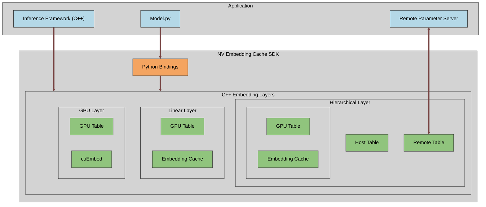

# Overview

The NV Embedding Cache SDK aims to accelerate all manner of embedding ops (similar to [torch.nn.Embedding](https://pytorch.org/docs/stable/generated/torch.nn.Embedding.html) or [torch.nn.EmbeddingBag](https://pytorch.org/docs/stable/generated/torch.nn.EmbeddingBag.html)), typically used in recommender system models. The SDK includes optimized CUDA kernels and various caching mechanisms, on GPU and CPU. Several embedding implementations are available for handling different sizes of embeddings, from pure GPU implementations suitable for smaller embeddings to hierarchical combination of GPU cache, CPU cache and remote parameter server, suitable for extermely large embeddings. The bulk of the code is in C++ with python bindings for easy integration with [PyTorch](https://pytorch.org/). See additional API details in: [cpp_api.md](cpp_api.md), [c_api.md](c_api.md) and [python_api.md](python_api.md).
The SDK leverages other NVIDIA libraries such as [cuEmbed](../third_party/cuembed/README.md) and [nvHashMap](../third_party/nvhashmap/README.md) as well as several 3rd party libraries, all of which can be found at [third_party/](../third_party/) (detailed list in the main [README.md](../README.md#3rd-party-dependencies))

The main focus is on inference, training support is limited.

## Block diagram

## Main design principles

We promote a "pick and choose" approach to the SDK componenets. So the functionality is divided into 3 levels where other software stacks can integrate.
Higher-level interfaces provide greater abstraction, minimizing the implementation burden and required domain knowledge from the calling software stack; in contrast, lower-level interfaces expose finer-grained control, but necessitate more intricate integration logic and a deeper understanding of the underlying system.
Users are encouraged to figure out which integration level suits their framework the most.

### Layers
The top level is the [embedding layer](../include/embedding_layer.hpp) level. At this level we expose C++ and Python objects that hold all the embedding data and provide lookup and modify services. Layers can combine data stored on multiple locations (see tables description below) and implement various access flows to get the best performance.
Layers manage one or more tables and during execution may create temporary resources to pass data between them.

Example layers are:
* [GPU Embedding Layer](../include/gpu_embedding_layer.hpp) - an embedding layer storing all data in GPU memory.
* [Linear Embedding Layer](../include/linear_embedding_layer.hpp) - an embedding layer storing data in linear system memory and using a cache in GPU memory.
* [Hierarchical Embedding Layer](../include/hierarchical_embedding_layer.hpp) - an embedding layer using the full storage hierarchy of GPU memory cache, system memory cache and remote paramter server.

### Tables
The middle level is the [table](../include/table.hpp) level. Tables represent a single data storage location (e.g. GPU tables store on GPU memory, Redis cluster tables store on remote Redis servers etc.). While tables provide lookup and modification services, similar to layers, they are not aware of other tables' operations. Such coordination of multiple tables is handled at the embedding layer level.
Example tables are:
* [GPU table](../include/gpu_table.hpp) - a table with storage in GPU memory.
* [nvHashMap table]() - a table with storage in system memory.
* [Redis cluster table]() - a table with storage on remote Redis servers
* [RocksDB table]() - a table with storage on remote RocksDB servers

### Low-level Components
This level is not as uniform in API or function as the other two. It is simply a collection of tools/mechanisms, the calling software stack can leverage individually. These are typically used by tables.
Examples include: 
* [cuEmbed](../third_party/cuembed/README.md) - a CUDA kernel library to accelerate embedding lookups.
* [EmbeddingCache](../include/ecache/) - a software managed GPU cache for embeddings. 

There are additional low-level components that are less likely to be used directly by client software. These are utlities we allow the user to override with their own specialized classes.
For example:
* [Thread pool](../include/thread_pool.hpp)
* [Allocator](../include/allocator.hpp)
* [Logger](../include/logging.hpp)

## Additional resources
* [C++ API](cpp_api.md)
* [C API](c_api.md)
* [Python API](python_api.md)
* [Samples](samples.md)
* [Advanced topics](advanced.md)
* [Multi-GPU and Multi-Node](multi_gpu.md)
